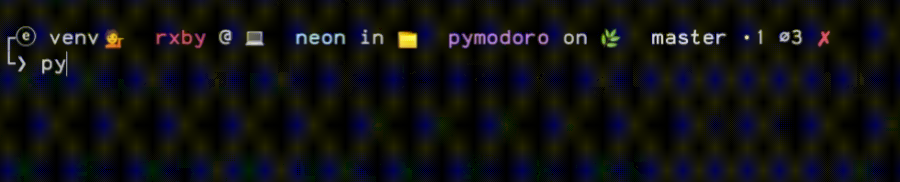
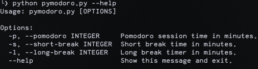

# Pymodoro


### Description
A simple pomodoro timer using a simple CLI with python.

_note: notifications only works on linux's that supports the `notify-send` command._

#### **What is the pomodoro technique?**
The _Pomodoro Technique_ was developed in the late 1980s by then university student Francesco Cirillo. Cirillo was struggling to focus on his studies and complete assignments. Feeling overwhelmed, he asked himself to commit to just 10 minutes of focused study time. Encouraged by the challenge, he found a **tomato** (pomodoro in Italian) shaped kitchen timer, and the Pomodoro technique was born.

Though Cirillo went on to write a 130-page book about the method, its biggest strength is its simplicity:

- Get a to-do list and a timer.
- Set your timer for 25 minutes, and focus on a single task until the timer rings.
- When your session ends, mark off one pomodoro and record what you completed.
- Then enjoy a five-minute break.
- After four pomodoros, take a longer, more restorative 15-30 minute break.

### Installation
- Clone the repository
    ```
    git clone https://github.com/manuelIsCoding/pymodoro.git
    ```
- Start the virtual environment
    ```
    cd pymodoro
    source ./venv/bin/activate
    ```
- Install the requirements
    ```
    pip install -r requirements.txt
    ```
- Run the `pymodoro.py` file
    ```
    python pymodoro.py
    ```

### Usage
The duration of the sessions and breaks are set by default
to 25 minutes pomodoro, 5 minutes short break and 10 minutes long break.

You can change it's values using the following cli options:

- Setting a 50/10 pomodoro session.
    ```
    python pymodoro.py --pomodoro 50 --short-break 10 --long-break 30
    ```
- or you can use `-p`, `-s` and `-l` instead:
    ```
    python pymodoro.py -p 50 -s 10 -l 30
    ```

Use the _--help_ option to see all options.



___
Feel free to clone this repository and improve or modify the code
as you want.